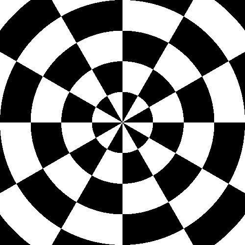
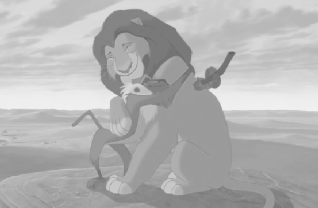
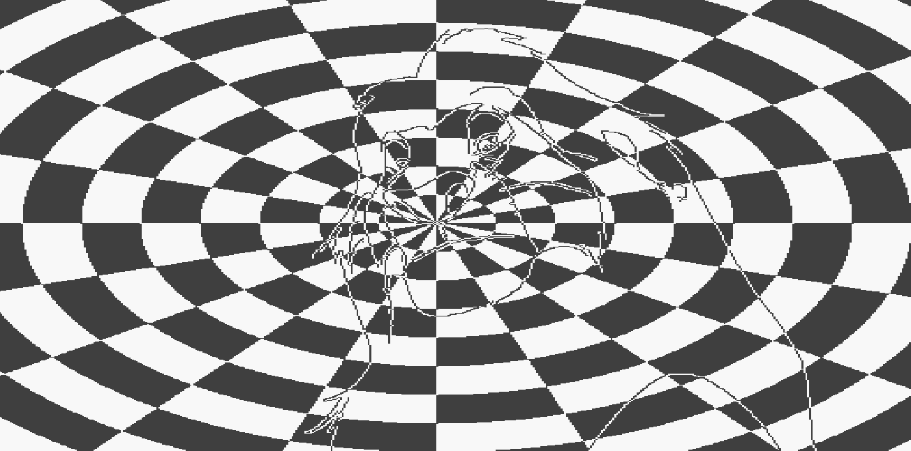

# FNIRS Stimulation Routines

This is the code used to stimulate adults and children with radial checkerboard blended with animated cartoons.

## Requirements

This code relies on a number of external libraries:

* [OpenCV](https://docs.opencv.org/master/d6/d00/tutorial_py_root.html)
* [ffpyplayer](https://pypi.org/project/ffpyplayer/)
* [LabStreaming Layer](https://github.com/sccn/labstreaminglayer)
* [Psychopy](https://www.psychopy.org/)
* [Numpy](https://numpy.org/)
* [Matplotlib](https://matplotlib.org/)

Prior to run the code all the libraries should be installed.
The recording system must be connected on the same network to be visible. Connection should be set up in accordance with the recording system configuration.
We use a NIRSport 8x8 with Aurora Software 14.0.
This is the configuration for our system:

```python
info = StreamInfo(name = "Trigger", type = "Markers",
                  channel_count=1, channel_format='int32',
                  source_id='Aurora')
outlet = StreamOutlet(info)
```

With this configuration you can send triggers to the recording system using the command:

```python
outlet.push_sample(['event name'])
```

## radial_checkerboard.py

This script shows a radial checkerboard stimulus sending two kinds of event markers:

| Event    | Marker | Contrast |Sample|
|----------|--------|----------|------|
| blank    | 1      |       0% |      |
| stimulus | 2      | 90%      | |

### Parameters

* **trial_number** Number of blank and stimulus trials (The total number ot trials is trial_number*2 )
* **time_stim**  Duration of events in seconds
* **time_intertrial**  duration of intertrial time in seconds
* **freq**  Contrast reversal frequency in Hz

To change stimulus features read Psychopy [radialstim](https://www.psychopy.org/api/visual/radialstim.html)

To change other parameters such as luminance and contrast read Psychopy3 manual.

## cartoon.py

This script shows a radial checkerboard stimulus blended with a edge filtered animated cartoon. During baseline it shows a low contrast grayscale animated cartoon. It sends two kinds of event markers:

| Event    | Marker | Contrast |Sample|
|----------|--------|----------|------|
| blank    | 1      |       0% | [](cartoon_b.png)     |
| stimulus | 2      | 90%      |[](cartoon_s.png) |

### Movie Parameters

* **number_of_trials** Number of stimulations (contrast inversion) and blanks (no changes in contrast) trials [the total number of trigger delivered is number_of_trials * 2]
* **intertrial** intertrial duration in secs
* **tex_dur** stimulation duration in secs
* **start_sec** Start the movie from  this second
* **stim_freq**  Stimulus contrast inversion frequency in Hz
* **cnt_stim** image contrast during stimulation [0 to 1]
* **cnt_baseline** image contrast during baseline [0 to 1]
* **luminance** mean luminance [0 to 1]
* **gamma** monitor gamma
